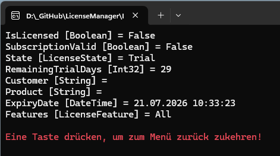
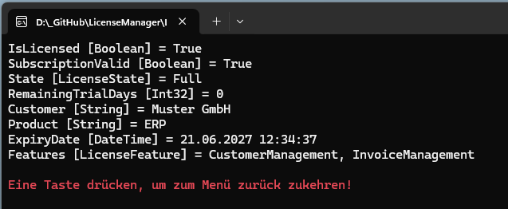

# License Manager


## Projekt 
Das Ursprüngliche Projekt wurde mal unter .Net Framework 3.0 erstellt. Das Beispiel soll zeigen, wie ein einfacher aber effektiver Lizent Manager erstell werden kann.

## Hinweis
Der Source ist soll auch einfache Art und Weise die Funktionen eines Features zeigen. Der Source ist so geschrieben, das so wenig wie möglich zusätzliche NuGet-Pakete benötigt werden.

## Features
- Verwaltung/Erstellung von Trail Versionen
- Features Verwaltung
- Features Profile

## Screenshot





## Beispielsource

Erstellen des Private und Puplic Key (der Private Key darf nicht weitergegeben werden)

```csharp
KeyGenerator.Create();
```
Der Lizenz Key muß nur einmal pro Lizenz/Anwendung aufgerufen werden. Dieser darf sich nicht ändern, da sonst die `license.lic` nicht mehr passt.

Lizenzdatei `license.lic` erstellen. Hierzu kann ein eigenes Programm erstellt werden, das die Erstellung und Verwaltung der Lizenz Informationen übernimmt.
```csharp
MachineId machineId = MachineIdProvider.GetMachineId();
LicenseGenerator.Generate("Muster GmbH", "ERP", machineId, expiryDate: DateTime.Now.AddYears(1), LicenseProfiles.Enterprise, subscriptionId: "SUB-2026-0001", privateKeyFile: "private.key", outputFile: "license.lic");
```

Lesen der Lizenzdatei `license.lic` .

```csharp
Features.LicenseManager.Initialize();
Features.LicenseContext license = Features.LicenseManager.GetContext();
```

In der Variabel `license`stehen alle Lizentinformation die über den `LicenseContext` für die Anwendung ermittelt wurden.

Lizenzdatei `license.lic`

```json
{
  "Customer": "Muster GmbH",
  "Product": "ERP",
  "MachineId": {
    "value": "CAA2E2DFD25218B019B17DEB2C39063524A1F428C9C0A589488715C571F8CF67"
  },
  "ExpiryDate": "2027-06-21T13:01:42.7419535+02:00",
  "SubscriptionId": "SUB-2026-0001",
  "Features": 3,
  "Signature": "H38ieT2iikP08sqhTtwC7GPZK7Jto6HaE9yTZJ\u002BR2AF1E7WbMau/v5eT2WFH5AaclJuorUECXMZD4lw19H9CCKBY18VwMk2TJU7CU3rSYUYzUUrYsUf4Q45IRtUieVREwWqXa36qInPsTBfGTPVzRkisldYav/98iu9iQCL8vzwc73V1gatnN3HwtlctsZ31RQlM0ENkEkMoov343aQdWz6Ky/rz9gXyDDGbUjwfvrta/SO14oDPDSo\u002Bm80ZIhNraUkWqA13t0WITg72anAfNwP2clbPWoK0BEOyeOi8Vw8PYv0hA8bYHjd1g3quToUy8v0pfxI\u002BN0bJAe6R300Q0g=="
}
```

# Versionshistorie

- Migration auf NET 10
